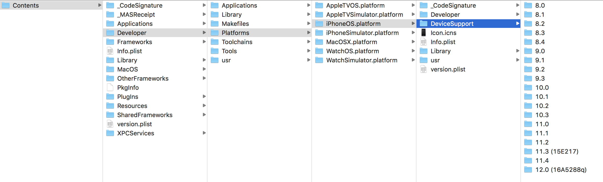

# DeveloperDiskImage

iOS latest DeveloperDiskImage.Extract from latest Xcode.

# How to use

## Manual

Click on "Finder" in MAC OS  
Click on "Go to Folder"  
Paste this path over their (make sure that you have installed xcode with named : "Xcode.app") `/Applications/Xcode.app/Contents/Developer/Platforms/iPhoneOS.platform/DeviceSupport`   
Paste your extracted directory to that place  
quite Xcode and restart it. you can run your projects successfully in your real device  

## Auto
`wget https://raw.githubusercontent.com/pdso/DeveloperDiskImage/master/install.py`  
`sudo python install.py`
